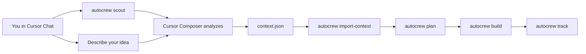

# AutoCrew — Cursor Composer Workflow (Option A)

Run AutoCrew **without** `ANTHROPIC_API_KEY` or `OPENAI_API_KEY`. Cursor Composer acts as the brain; AutoCrew handles squad generation, planning, build orchestration, and tracking.

## Setup (no API keys needed)

```bash
pip install -e ".[dev]"
copy .env.example .env
# Leave ANTHROPIC_API_KEY and OPENAI_API_KEY empty
```

## Workflow overview



## Path 1: New project idea

1. Open Cursor chat and say something like:

   > Analyze this idea for AutoCrew and create a `context.json` file:
   > "Build a SaaS CRM with auth, contacts, and billing using Next.js and FastAPI"

2. Ask Cursor to save the JSON using the schema in [`docs/templates/context.example.json`](templates/context.example.json).

3. Import and continue:

   ```bash
   autocrew import-context context.json
   autocrew plan
   autocrew debate --root ./my-project
   autocrew build --yes
   autocrew track
   ```

## Path 2: Existing codebase

1. Export codebase snapshot for Cursor:

   ```bash
   autocrew scout ./my-project --output output/scout.json
   ```

2. In Cursor chat:

   > Read `output/scout.json` and create a ProjectContext JSON for AutoCrew.
   > Mark features as done/partial/not_started based on real evidence in the files.
   > Save to `output/contexts/my_project_context.json`

3. Import and continue:

   ```bash
   autocrew import-context output/contexts/my_project_context.json
   autocrew plan --root ./my-project
   autocrew build --root ./my-project --yes
   autocrew track --root ./my-project
   ```

## Commands that work without API keys

| Command | Needs API key? |
|---------|----------------|
| `autocrew scout` | No |
| `autocrew import-context` | No |
| `autocrew plan` | No (uses standard task templates) |
| `autocrew debate` | No (squad critique rounds until consensus) |
| `autocrew build` | No (orchestration + scoped file writes) |
| `autocrew track` | No |
| `autocrew status` | No |
| `autocrew new` | Yes |
| `autocrew analyze` | Yes |

## Context JSON schema

Required fields:

- `project_type`: `"new_idea"` or `"existing_code"`
- `project_name`: string
- `domain`: `saas` | `mobile_app` | `api` | `data_pipeline` | `ecommerce` | `ai_tool` | `other`
- `description`: string
- `tech_stack`: `{ frontend, backend, devops, other }` arrays
- `features`: array of `{ name, description, status, priority }`

For existing codebases, also set:

- `codebase_path`: absolute or relative path to the project folder
- `existing_files`: list of relative file paths (optional; scout provides these)
- `missing_parts`: list of gaps Cursor identified

See [`docs/templates/context.example.json`](templates/context.example.json) for a full example.

## Prompt template for Cursor

Copy this when asking Composer to create context JSON:

```
You are analyzing a project for AutoCrew.

Return ONLY a valid JSON object matching docs/templates/context.example.json.
- For new ideas: project_type = "new_idea", all features status = "not_started"
- For existing code: project_type = "existing_code", set codebase_path, mark features conservatively (done only with real implementation evidence)

Project / codebase:
[PASTE IDEA OR REFERENCE scout.json HERE]
```

## Tips

- **Review before build:** Always run `autocrew plan` and read `docs/product.md` before `autocrew build`.
- **Target folder:** Use `--root ./my-project` so generated files land in the right place.
- **Skip confirmations:** Add `--yes` to `import-context` and `build` when running from scripts or Cursor terminal.
